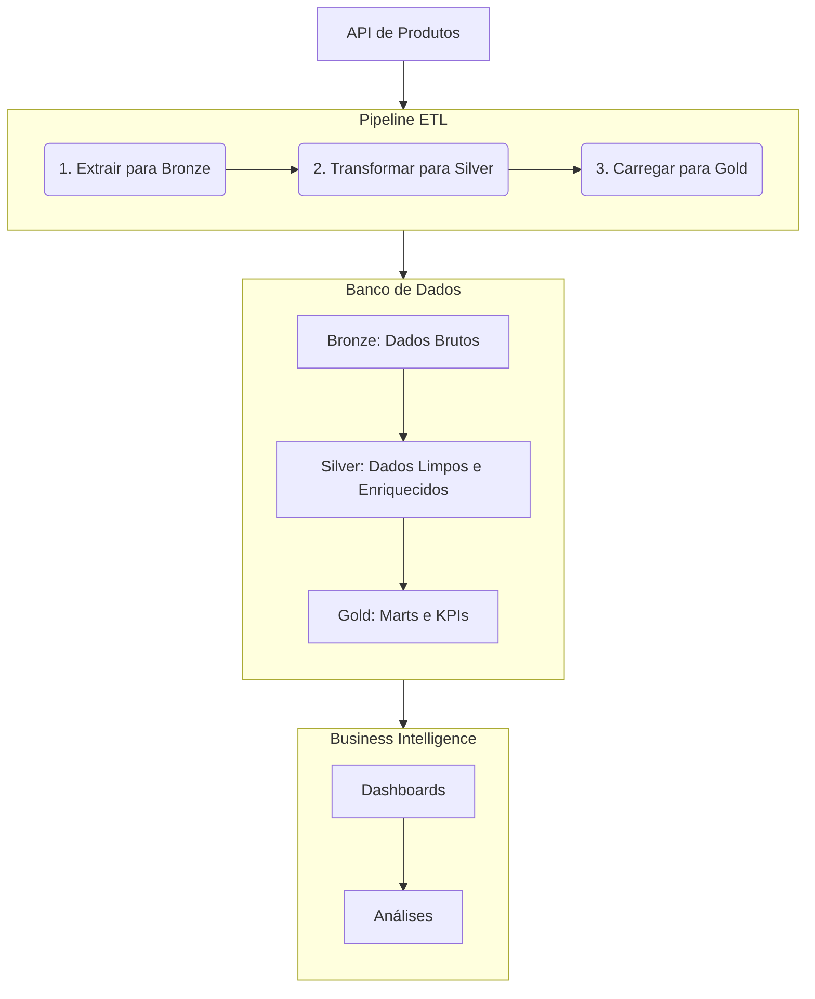

# Pipeline de Dados de Produtos com Airflow e Metabase

Este repositório contém um projeto completo de engenharia de dados que implementa um pipeline ETL (Extração, Transformação e Carga) para análise de dados de vendas de produtos. A solução é totalmente containerizada usando Docker e orquestrada com Apache Airflow, seguindo as melhores práticas como a arquitetura Medallion e o provisionamento de infraestrutura como código.

## Visão Geral

O objetivo deste projeto é extrair dados de vendas de uma API, processá-los através de um pipeline robusto, armazená-los em um banco de dados PostgreSQL e, finalmente, disponibilizá-los para análise e visualização em uma ferramenta de Business Intelligence (Metabase).

## Principais Funcionalidades

*   **Orquestração com Apache Airflow:** Pipeline de dados agendado e monitorado através de uma DAG (Directed Acyclic Graph) do Airflow.
*   **Arquitetura Medallion:** Os dados são processados em três camadas distintas (`Bronze`, `Silver` e `Gold`) para garantir qualidade, rastreabilidade e governança.
*   **Enriquecimento de Dados Geográficos:** O pipeline não apenas limpa, mas também enriquece os dados com informações geográficas, como regiões do Brasil e cálculo de distâncias, além de tratar coordenadas inválidas.
*   **Infraestrutura como Código:** Todo o ambiente, incluindo o banco de dados e a ferramenta de BI, é definido e gerenciado pelo arquivo `docker-compose.override.yml`.
*   **Data Marts e KPIs:** A camada `Gold` contém tabelas agregadas (Data Marts) e KPIs (Key Performance Indicators) prontos para o consumo por analistas de dados e dashboards.
*   **Visualização com Metabase:** O projeto inclui um serviço do Metabase pré-configurado para se conectar facilmente ao banco de dados e explorar os resultados.

## Arquitetura da Solução

O fluxo de dados segue as etapas abaixo:



1.  **Extração (Bronze):** A DAG do Airflow (`pipeline_produtos_v3`) é executada diariamente, extraindo os dados da API `https://labdados.com/produtos` e salvando-os em formato JSON bruto na tabela `bronze.raw_produtos`.
2.  **Transformação (Silver):** Os dados brutos são limpos, padronizados, e enriquecidos. Coordenadas geográficas inválidas são corrigidas, e novas colunas (como `regiao` e `distancia_sp_km`) são adicionadas. O resultado é salvo na tabela `silver.produtos_clean`.
3.  **Carga (Gold):** A partir dos dados limpos, são criadas diversas tabelas analíticas (marts) e KPIs na camada `Gold`. Essas tabelas são agregadas e otimizadas para consultas de BI.
4.  **Visualização:** O Metabase se conecta à camada `Gold` do PostgreSQL, permitindo que usuários de negócio criem dashboards e análises de forma intuitiva.

## 🛠️ Stack de Tecnologias

*   **Orquestração:** Apache Airflow
*   **Processamento de Dados:** Python, Pandas
*   **Banco de Dados:** PostgreSQL
*   **BI & Visualização:** Metabase
*   **Containerização:** Docker, Docker Compose

## 🚀 Como Executar o Projeto

### Pré-requisitos

*   [Docker](https://www.docker.com/get-started)
*   [Docker Compose](https://docs.docker.com/compose/install/) (geralmente incluído na instalação do Docker Desktop)
*   [Astro CLI](https://www.astronomer.io/docs/astro/cli/install-cli) para um ambiente de desenvolvimento Airflow local simplificado.

### 1. Configuração da Infraestrutura

O `docker-compose.override.yml` provisiona os serviços de banco de dados e Metabase.

Para iniciar a infraestrutura, execute o seguinte comando na raiz do projeto:

```bash
astro dev start
```

Isso irá:
*   Criar um container PostgreSQL chamado `astro_postgres_extra` acessível na porta `5433` da sua máquina local.
*   Executar o script `init-db.sql` para criar os bancos de dados (`analytics`, `metabase_app`), os schemas (`bronze`, `silver`, `gold`) e o usuário para o Airflow.
*   Criar um container Metabase chamado `astro_metabase` acessível em [http://localhost:3000](http://localhost:3000).

### 2. Configuração do Airflow

Para que a DAG possa se conectar ao banco de dados, você precisa configurar uma conexão no Airflow.

*   **ID da Conexão (Conn Id):** `postgres_analytics`
*   **Tipo da Conexão (Conn Type):** `Postgres`
*   **Host:** `postgres-extra` (nome do serviço no Docker Compose)
*   **Schema:** `analytics`
*   **Login:** `airflow_user`
*   **Senha:** `airflow_pass`
*   **Porta:** `5433`

Após configurar a conexão, ative a DAG `pipeline_produtos_v3` na UI do Airflow e dispare uma execução manual para popular o banco de dados.

### 3. Configuração do Metabase

1.  Acesse o Metabase em [http://localhost:3000](http://localhost:3000).
2.  Siga as instruções iniciais para criar uma conta de administrador.
3.  Na etapa de adicionar dados, selecione "PostgreSQL" e preencha com as seguintes informações:
    *   **Host:** `postgres-extra` (nome do serviço no Docker Compose)
    *   **Porta:** `5432` (porta interna da rede Docker)
    *   **Nome do banco de dados:** `analytics`
    *   **Nome de usuário:** `postgres`
    *   **Senha:** `postgres`
4.  Pronto! Agora você pode explorar as tabelas do schema `gold` e começar a criar suas análises e dashboards.

## Detalhes do Pipeline (`pipeline_produtos_v3`)

A DAG é o coração do projeto e é composta pelas seguintes tarefas principais:

*   **`criar_schemas` e `criar_tabelas`:** Garantem que a infraestrutura no banco de dados (schemas e tabelas da camada Bronze) exista antes da execução.
*   **`extrair_dados_api`:** Conecta-se à API, extrai os dados e os armazena na tabela `bronze.raw_produtos`.
*   **`transformar_para_silver`:** Lê os dados da camada Bronze e aplica uma série de transformações:
    *   Normaliza a estrutura JSON.
    *   Converte tipos de dados (`Data da Compra` para datetime, colunas numéricas).
    *   Padroniza campos de texto.
    *   Valida e corrige coordenadas geográficas, usando o centro do estado como fallback.
    *   Enriquece os dados com a `regiao` e a `distancia_sp_km`.
*   **`criar_marts_gold`:** Cria agregações de negócio, como:
    *   `mart_vendas_categoria`: Vendas, preço médio e avaliação por categoria.
    *   `mart_performance_estado`: Vendas, frete e avaliação por estado.
    *   `mart_vendas_temporal`: Análise de vendas ao longo do tempo.
    *   `mart_top_produtos`: Ranking dos produtos mais vendidos.
*   **`criar_mart_geografico`:** Cria uma tabela otimizada para visualizações em mapas, com coordenadas médias por estado e rankings.
*   **`criar_kpis_dashboard`:** Gera tabelas com KPIs consolidados para alimentar dashboards de alta performance, incluindo métricas de crescimento e participação de mercado.
*   **`log_pipeline_stats`:** Ao final, registra um resumo da execução, informando quantos registros foram processados em cada etapa.

## Autor
[Wellington M Santos](https://www.linkedin.com/in/wellington-moreira-santos/)
